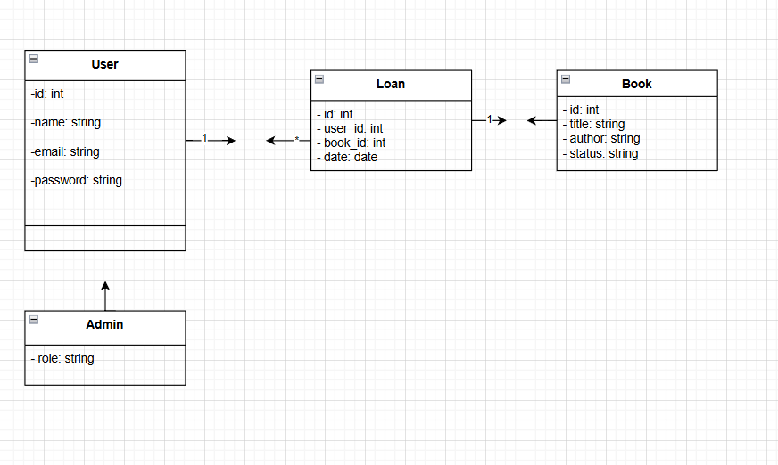
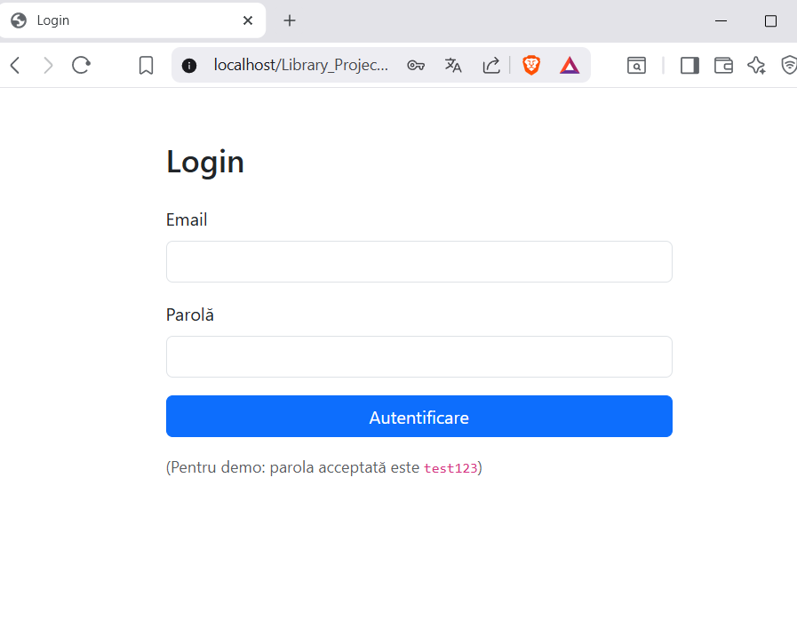
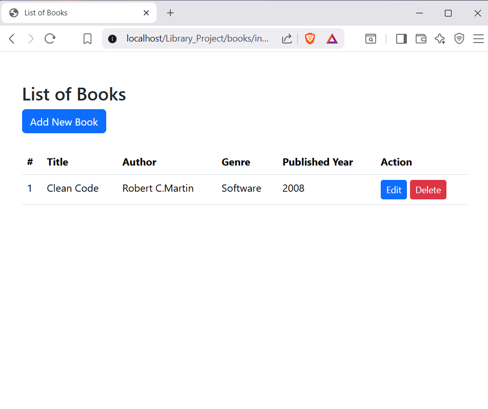
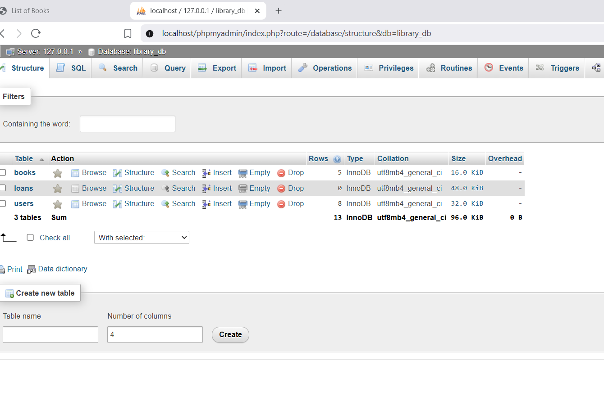

Library Management Project GitHub Repository: <https://github.com/Ailar01/Library_Project>

Descriere
Această aplicație web gestionează utilizatori și cărți pentru o bibliotecă online.  
Include funcționalități de login/register, CRUD pentru cărți, și administrarea împrumuturilor.

Scopul proiectului este de a simula modul real de funcționare al unei biblioteci digitale, folosind tehnologii moderne.

---

Tehnologii folosite
- PHP 8.0
- MySQL (bază de date)
- XAMPP (Apache server + phpMyAdmin)
- GitHub (versionare)
-VS Code (editor cod)

---

Cum rulezi proiectul
1. Clonează repository-ul:

2. Mută folderul proiectului în `htdocs` din XAMPP.
3. Pornește XAMPP și activează Apache+ MySQL.
4. În browser, accesează:

5. Importă baza de date în phpMyAdmin (folosind fișierul din folderul `database`).

---
UML Diagram

User Stories
[Vezi User Stories](docs/user_stories.md)

Screenshots
Login Page

Books Page

Database in phpMyAdmin

Prompt Engineering
În timpul dezvoltării proiectului, am folosit ChatGPT pentru:
- Generarea exemplelor de cod PHP.
- Structurarea interogărilor SQL.
- Optimizarea designului aplicației.
- Sugestii de implementare a funcționalităților.

Această experiență m-a ajutat să obțin un proces de dezvoltare mai eficient și să învăț să formulez prompturi clare și utile.

---

Demo Video

[Watch the demo](https://youtu.be/WfUrOGYVr94)

> Notă: Video-ul arată funcționalitățile principale ale aplicației într-o prezentare rapidă.

---

Structura proiectului
Library_Project/
│
├── books/ # Module legate de cărți (CRUD)
├── users/ # Module legate de utilizatori
├── login-register/ # Autentificare și înregistrare
├── docs/ # Documentație (UML, User Stories)
│ ├── uml.png
│ └── user_stories.md
├── vendor/ # Dependențe (composer)
├── database.php # Conexiunea la baza de date
├── test.php # Test pentru conexiune
└── README.md

---
Contribuții
Proiect realizat de Aylar Yazmyradova, grupa 233.
